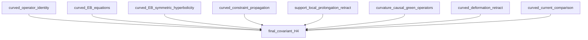

# Final covariant claim dependency report

This report is generated from the atomic certificates. Each derived claim
uses its displayed all/any dependency mode.

## Dependency flow

## Theorem boundary

| Curved lemma | Status | Direct requirements |
| --- | --- | --- |
| `curved_operator_identity` | **true** | `curved_hessian_expanded`, `curved_companion_expanded`, `curved_Q_nilpotency`, `curved_witness_identity`, `curved_formal_adjointness`, `curved_globalization_coverage` |
| `curved_deformation_retract` | **true** | `support_preserving_retract` |
| `curved_current_comparison` | **true** | `curved_auxiliary_shift_is_BV_canonical`, `exact_action_Fourier_current_improvement`, `curved_auxiliary_presymplectic_potential`, `curved_metric_presymplectic_potential`, `curved_cauchy_boundary_current`, `curved_auxiliary_metric_current_identity`, `EAL_pairing_regression` |

## Final claims

| Claim | Status | Requires |
| --- | --- | --- |
| `complete_bv_green_hyperbolicity` | **false** | `curved_auxiliary_hessian_exact`, `support_preserving_retract`, `curvature_green_realization`, `curved_Q_nilpotency`, `curved_witness_identity`, `curved_formal_adjointness` |
| `support_preserving_metric_equivalence` | **true** | `curved_deformation_retract`, `support_preservation` |
| `pairing_compatibility` | **false** | `curved_current_comparison`, `green_homotopies`, `curved_green_current`, `EAL_pairing_regression` |
| `causal_quasi_isomorphism` | **false** | `compact_to_global_quasi_isomorphism` |
| `CKV_recovery` | **false** | `green_homotopies`, `ckv_cutoff_identity` |
| `residual_no_duplication` | **false** | `support_preserving_metric_equivalence`, `CKV_recovery`, `algebraic_residual_no_duplication` |
| `energy_H4_is_C2` | **true** |  |
| `energy_gram_is_I2` | **true** |  |
| `final_covariant_H4` | **false** | `curved_operator_identity`, `curved_deformation_retract`, `curved_current_comparison`, `curved_EB_equations`, `curved_EB_symmetric_hyperbolicity`, `curved_constraint_propagation`, `support_local_prolongation_retract`, `curvature_causal_green_operators`, `causal_quasi_isomorphism`, `CKV_recovery`, `residual_no_duplication`, `energy_H4_is_C2`, `energy_gram_is_I2` |

## Implemented scaffold

- `curved_auxiliary_hessian_exact` — The complete action-derived curved Hessian table is exact, formally adjoint, and has 630/630 high-order jet coverage.
- `physical_symbol_quotient_exact` — The normalized Hessian image modulo the gauge image is exactly two-dimensional.
- `physical_symbol_is_helicity_two` — The two quotient directions are the real helicity-two pair transverse to the null direction.
- `weyl_symbol_helicity_isomorphism` — On the exact Hessian-reduced physical quotient, the linearized Weyl symbol is an isomorphism onto the two helicity-two curvature directions.
- `candidate_curvature_principal_symmetric_hyperbolicity` — The candidate electric/magnetic Weyl principal block has a positive symmetrizer and the two physical characteristic speeds in each direction; derivation from the curved prolonged equations remains open.
- `candidate_curvature_principal_constraints_propagate` — The principal divergence constraints close through div(curl_2 h)=(1/2)curl_1(div h).
- `support_preservation` — The displayed finite differential and pointwise maps do not enlarge support.
- `green_witness_recognition_theorem` — Formal Green consequences hold once the curved witness hypotheses hold.
- `compact_cylinder_spacelike_support` — On R x S^3 every smooth section is spacelike compact.
- `EAL_pairing_regression` — The reduced physical current has the certified +E,-A,-L normalization.
- `ckv_cutoff_identity` — The cutoff-source identity recovers all fifteen modes once Lambda exists.
- `algebraic_residual_no_duplication` — The algebraic BFV replacement contains one ghost and one momentum copy.
- `energy_H4_is_C2` — The completed energy-mode centered cohomology is the certified two-class space.
- `energy_gram_is_I2` — The completed energy-mode cohomological Gram matrix is I_2.
- `curved_action_and_gauge_map` — The exact covariant action and its curved 24-by-9 gauge map are instantiated.
- `parallel_curvature_derivative_normal_form` — Covariant derivative words reduce canonically using the parallel cylinder curvature.
- `curved_auxiliary_shift_is_BV_canonical` — The nonlinear completion-of-square shift has its exact local cotangent lift.
- `universal_post_shift_auxiliary_SDR` — The universal 36-dimensional shifted auxiliary cotangent summand contracts exactly.
- `exact_action_Fourier_current_improvement` — The action-level Fourier currents differ by an explicit antisymmetric improvement.
- `support_preserving_retract` — The complete all-row curved SDR is local and support preserving, independently of the Green realization.

## Remaining curvature-propagation theorem

The selected final gate is the constrained symmetric-hyperbolic
Weyl-curvature realization. The reduced Weyl-symbol theorem and the
candidate principal matrix/constraint algebra are true; the five
displayed curved realization flags remain open.

- `curved_EB_equations` — Derive the complete electric/magnetic Weyl equations from the curved linearized Bianchi/Cotton and Bach identities.
- `curved_EB_symmetric_hyperbolicity` — Identify the actual curved E/B coefficient matrices and prove the positive STF form symmetrizes them.
- `curved_constraint_propagation` — Derive the complete homogeneous curved evolution of every E/B constraint.
- `support_local_prolongation_retract` — Construct the local Psi-W(h) prolongation equivalence without inverse curl, Laplacian, or helicity projector.
- `curvature_causal_green_operators` — Construct retarded and advanced operators for the exact constrained curvature system and assemble the full BV blocks.

> The algebraic and energy-mode result is independently certified:
> `H^4 = C^2` with Gram matrix `I_2`. This report tracks its
> still-open covariant transport.
