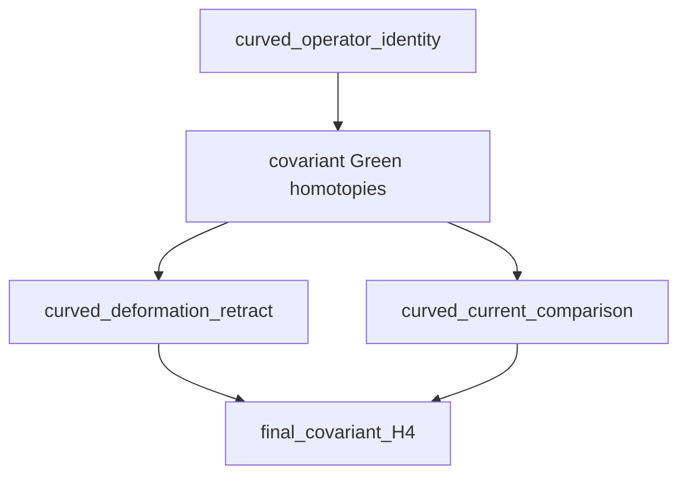

# Final covariant claim dependency report

This report is generated from the atomic certificates. A derived claim is
true only when every listed dependency is true.

## Dependency flow

## Theorem boundary

| Curved lemma | Status | Direct requirements |
| --- | --- | --- |
| `curved_operator_identity` | **false** | `curved_hessian_expanded`, `curved_companion_expanded`, `curved_Q_nilpotency`, `curved_witness_identity`, `curved_formal_adjointness`, `degreewise_wave_symbols`, `curved_globalization_coverage` |
| `curved_deformation_retract` | **false** | `green_homotopies`, `curved_auxiliary_shift_is_BV_canonical`, `universal_post_shift_auxiliary_SDR`, `curved_metric_to_aux_chain_map`, `curved_aux_to_metric_chain_map`, `curved_retract_identity`, `curved_Q_conjugation`, `curved_all_BV_rows`, `support_preservation` |
| `curved_current_comparison` | **false** | `green_homotopies`, `curved_auxiliary_shift_is_BV_canonical`, `exact_action_Fourier_current_improvement`, `curved_auxiliary_presymplectic_potential`, `curved_metric_presymplectic_potential`, `curved_green_current`, `curved_cauchy_boundary_current`, `curved_auxiliary_metric_current_identity`, `EAL_pairing_regression` |

## Final claims

| Claim | Status | Requires |
| --- | --- | --- |
| `complete_bv_green_hyperbolicity` | **false** | `curved_Q_nilpotency`, `curved_witness_identity`, `degreewise_normal_hyperbolicity`, `curved_formal_adjointness` |
| `support_preserving_metric_equivalence` | **false** | `curved_deformation_retract`, `support_preservation` |
| `pairing_compatibility` | **false** | `curved_current_comparison`, `EAL_pairing_regression` |
| `causal_quasi_isomorphism` | **false** | `compact_to_global_quasi_isomorphism` |
| `CKV_recovery` | **false** | `green_homotopies`, `ckv_cutoff_identity` |
| `residual_no_duplication` | **false** | `support_preserving_metric_equivalence`, `CKV_recovery`, `algebraic_residual_no_duplication` |
| `energy_H4_is_C2` | **true** |  |
| `energy_gram_is_I2` | **true** |  |
| `final_covariant_H4` | **false** | `curved_operator_identity`, `curved_deformation_retract`, `curved_current_comparison`, `causal_quasi_isomorphism`, `CKV_recovery`, `residual_no_duplication`, `energy_H4_is_C2`, `energy_gram_is_I2` |

## Implemented scaffold

- `degreewise_wave_symbols` — Every emitted degree has scalar metric principal symbol.
- `support_preservation` — The displayed finite differential and pointwise maps do not enlarge support.
- `green_witness_recognition_theorem` — Formal Green consequences hold once the curved witness hypotheses hold.
- `compact_cylinder_spacelike_support` — On R x S^3 every smooth section is spacelike compact.
- `EAL_pairing_regression` — The reduced physical current has the certified +E,-A,-L normalization.
- `ckv_cutoff_identity` — The cutoff-source identity recovers all fifteen modes once Lambda exists.
- `algebraic_residual_no_duplication` — The algebraic BFV replacement contains one ghost and one momentum copy.
- `energy_H4_is_C2` — The completed energy-mode centered cohomology is the certified two-class space.
- `energy_gram_is_I2` — The completed energy-mode cohomological Gram matrix is I_2.
- `curved_action_and_gauge_map` — The exact covariant action and its curved 24-by-9 gauge map are instantiated.
- `parallel_curvature_derivative_normal_form` — Covariant derivative words reduce canonically using the parallel cylinder curvature.
- `curved_auxiliary_shift_is_BV_canonical` — The nonlinear completion-of-square shift has its exact local cotangent lift.
- `universal_post_shift_auxiliary_SDR` — The universal 36-dimensional shifted auxiliary cotangent summand contracts exactly.
- `exact_action_Fourier_current_improvement` — The action-level Fourier currents differ by an explicit antisymmetric improvement.

## Atomic blockers for `final_covariant_H4`

- `curved_hessian_expanded` — Differentiate the exact covariant action to emit the complete curved auxiliary Hessian.
- `curved_companion_expanded` — Emit the complete curved gauge companion from the exact gauge-fixing density.
- `curved_Q_nilpotency` — Expand the curved four-row Q and exhaust its squared defect in canonical normal form.
- `curved_witness_identity` — differentiate the displayed covariant action and gauge-fixing density to emit E_aux,cyl and C_aux,cyl in the canonical normal form, then evaluate the globalization ledger
- `curved_formal_adjointness` — Evaluate every covariant integration-by-parts adjoint defect after the lower terms are emitted.
- `curved_globalization_coverage` — Exhaust every required curved jet fibre and isotropy component before globalizing the operator identity.
- `curved_metric_to_aux_chain_map` — Instantiate the metric-to-auxiliary chain map with all curved lower terms.
- `curved_aux_to_metric_chain_map` — Instantiate the auxiliary-to-metric chain map with all curved lower terms.
- `curved_retract_identity` — Verify pi=1 and ip-1=Qk+kQ for the actual covariant operators.
- `curved_Q_conjugation` — Conjugate the complete curved four-row Q by the local BV-canonical transformation.
- `curved_all_BV_rows` — Reattach and verify every trace, antifield, ghost, and nonminimal curved row.
- `curved_auxiliary_presymplectic_potential` — Derive the complete curved auxiliary presymplectic potential from the exact action.
- `curved_metric_presymplectic_potential` — Derive the complete curved fourth-order metric presymplectic potential.
- `curved_green_current` — Prove equality of the causal Green pairing and the current pairing.
- `curved_cauchy_boundary_current` — Derive the exact slab current and prove equality on cohomology.
- `curved_auxiliary_metric_current_identity` — Verify j_aux-j_metric=db+Qc with all cylinder lower terms.

> The existing algebraic and energy-mode result remains independently
> certified: `H^4 = C^2` with Gram matrix `I_2`. This report concerns
> only its still-open covariant transport.
