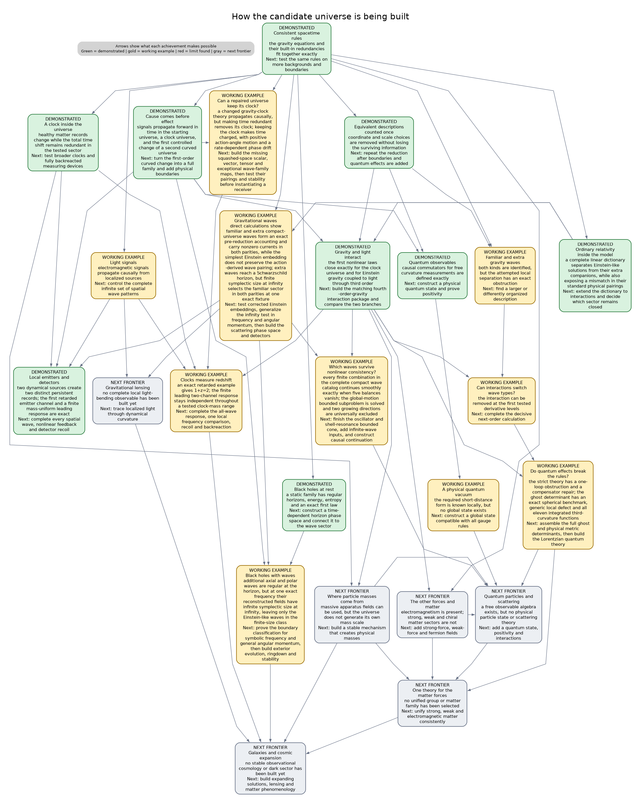

# Pure-Weyl gravity programme: executive summary for physicists

Last substantive update: 17 July 2026.

This is the short, live front door to the programme. It is written for a
physicist deciding whether the work intersects their own. It summarizes
results; it does not replace the technical manuscripts, certificate ledgers,
or the [universe-building roadmap](../notes/universe-building-roadmap.md).

> **Research context.** This programme is led by Asger Alstrup Palm, Honorary
> Professor at DTU Compute, as an investigation into whether agentic AI can
> make auditable contributions to scientific research. Palm is a computer
> scientist, not a physicist. The physics is therefore offered for expert
> scrutiny through typed claims, exact symbolic artifacts, independent
> verifiers, and explicit limitations—not on the authority of either the
> human director or the AI systems. The DTU affiliation identifies Palm's
> academic role and does not imply institutional endorsement of the project or
> its conclusions.

## The sixty-second version

Fourth-order gravity has more local solutions than Einstein gravity, and its
extra spin-two branch is normally associated with negative energy or norm.
Our starting point is that four logically different questions are often
collapsed into that one statement:

1. What modes solve the local field equations?
2. Which modes survive gauge, charge, and boundary reduction?
3. Which reduced structures survive interactions?
4. Which survive quantization and define asymptotic particles?

We have exact answers to substantial parts of the first two questions and
sharply scoped results on the third. We do not yet have the fourth.

The most complete field-theory result is for free pure-Weyl gravity on the
Lorentzian conformal cylinder, \(\mathbb R\times S^3\), in a selected
closed-universe, zero-charge BV--BFV sector. There the full covariant causal
complex is connected to the residual state complex by retarded and advanced
chain homotopies. After all fifteen residual \(SO(4,2)\) generators are
imposed as constraints, the vacuum and one-particle residual sectors are
acyclic. The first surviving classes are

\[
H^4=\operatorname{span}\{[W_+^2],[W_-^2]\},
\qquad G=I_2.
\]

These are positive-paired deformation or vertex classes, not positive-norm
graviton particles.

The restriction is physical, not cosmetic. On the unrestricted compact
linearized phase space, cylinder time translation \(D\) carries a charge and
is not gauge. It becomes gauge on the full Taub/moment-map zero fibre and its
selected derived quotient. A healthy rotating-scalar Berger-cylinder example
shows that a matter clock can coexist with a vanishing total \(D\) charge at
fixed couplings and linear order, but this is not yet a generic, nonlinear,
quantum, or asymptotic theorem.

The honest present verdict is therefore:

> The free classical cylinder theorem survives in its declared sector and now
> has a covariant causal realization. A universal claim that the fourth-order
> ghost is absent would be false; interactions, quantum anomalies, extra
> fourth-order branches, and asymptotic scattering remain decisive.

The newest compact Einstein--Maxwell calculation makes the extra-branch
qualification concrete. In the generic axial \(\ell\geq2\) block, the
Weyl--Maxwell solution module is strictly larger than the Einstein--Maxwell
image by two exact polarizations. The reduced current now matches a direct
four-dimensional Weyl--Maxwell Lee--Wald current. The extra block is
nonradical with signature \((2,0)\), while the complete generic axial target
has signature \((3,1)\); unexpectedly, its negative direction lies on one
Einstein-image master branch rather than on either extra direction. These are
compact classical current signs, not yet quantum norms or particle claims:
final residual descent, causal boundary admissibility, and a positive-frequency
state space remain open.

The construction graph below makes the dependency structure explicit. Green
nodes are certified foundations in a declared setting, amber nodes are active
frontiers with genuine partial results, and gray nodes remain open physical
milestones. Every colored node points back to named machine-verifiable
certificates; an arrow means that the lower claim depends on the upper one.



[Open the scalable public graph](../certificate_graph/universe-building-dag.svg)
or the [complete technical certificate DAG](../certificate_graph/certificate-dag.svg).

## How claims are typed

> **Comparison protocol.** Every conclusion is indexed by
>
> ```text
> (theory, background, generator, phase space, boundary conditions, lifecycle)
> ```
>
> Two conclusions are compared as competing physical claims only after these
> six entries have been matched or an explicit map between them has been
> proved. The same protocol is used in papers, talks, and external bridge
> notes.

This prevents a local mode, a compact reduced class, a boundary charge, and an
asymptotic particle from being treated as four descriptions of the same
object without proof. In particular, `LOCAL-ALGEBRAIC` and `REDUCED-MODE`
results are not reported as `LORENTZIAN-CAUSAL` or quantum theorems.

We use four plain-language states in this document:


- **Certified**: an exact artifact and an independent verifier establish the
  scoped claim.
- **Partial**: a real theorem or obstruction is established, but a named
  dependency needed for the larger conclusion is still open.
- **Fail-closed**: a proposed promotion was tested and is not accepted; this
  may be a no-go for one ansatz rather than for the theory.
- **Open**: the calculation required for the claim has not been completed.

## The result spine

This is the authoritative public claims table. Papers, talks, and bridge notes
should link to or quote its scoped rows rather than independently broadening
their status.

| Question | Current result | Status | Main limitation |
|---|---|---:|---|
| Can the free Pais--Uhlenbeck system admit a positive representation? | The positive symplectic metric is reconstructed canonically and its relation to Krein and real-form choices is classified. | **Certified** | Free representation theory is not interacting stability. |
| Does that positive structure survive interactions? | Explicit resonant conversion channels obstruct analytic continuation of the free positive metric; Einstein--Weyl cubic order is protected but a physical second-order channel is nonzero. | **Certified / Paper 6 under review** | These are specified interactions and sectors, not a universal no-go for every completion. |
| What is the selected residual cohomology of free pure-Weyl gravity on \(\mathbb R\times S^3\)? | Vacuum and one-particle sectors are acyclic; \(H^4\cong\mathbb C^2\), represented by \([W_+^2]\) and \([W_-^2]\), with normalized Gram matrix \(I_2\). | **Certified; Paper 7 artifact-ready** | All fifteen residual generators, including \(D\), are constrained in a zero-charge closed sector. The classes are deformations, not particles. |
| Is that residual calculation connected to the covariant field theory? | The complete free metric BV--BFV complex has causal retarded/advanced chain homotopies, compact-to-spacelike-compact transport, residual endpoint recovery, and matching Green/current/residual pairings. | **Certified; Paper 8 artifact-ready** | Conformal cylinder, free classical theory, selected polarization; no Hadamard or quantum construction. |
| Must \(D\) be gauge? | No. It is charged on the unrestricted compact phase space and gauge on the Taub-zero derived sector. | **Certified** | The answer is sector- and boundary-dependent. |
| Can a healthy clock coexist with total \(D\)-gauge? | On one positive Berger-cylinder background, fixed-coupling linearized constraints force \(\delta Q_D=0\) although the matter clock has nonzero internal momentum. | **Certified in the stated linear sector** | Relational observables, nearby backgrounds, nonlinear closure, and quantum stability are not all complete. |
| Is there a clock-defined redshift observable? | A positive-energy source-free Maxwell mode gives a Diff-, Weyl-, Maxwell-gauge-, and total-\(D\)-invariant compact spatially averaged relational frequency ratio; the exact fixture has \(1+z=2\). A lone travelling mode has a homogeneous Hopf-flux obstruction, while a coherent counter-propagating standing wave cancels it and admits an exact second-order homogeneous gravity correction with positive Maxwell energy. | **Certified G0 fixture plus scoped second-order interaction pass** | Localized endpoints and apparatus recoil, a compact retarded source, the support-local single-beam response, all-orders backreaction, phenomenology, and quantum interpretation remain open. |
| Does the Berger nonlinear Cartan mechanism survive first contact with interactions? | The complete support-local gravitational \(q_2\) and \(q_3\) are exact and cyclic; a causal cyclic \(D\)-Cartan contraction has been constructed through arity three on all 54 rows. The balanced Maxwell fixture supplies a separate exact second-order reduced-mode gravity correction. | **Certified algebraically and at the stated classical causal level** | This is not an all-orders or complete coupled Maxwell-BV result. Arity four if required, localized/support-local light coupling, QME restoration, and quantum claims remain open. |
| Is ordinary Einstein--Maxwell radiation present inside the Weyl--Maxwell system? | The complete standard fixed-bundle harmonic Einstein--Maxwell tangent injects on shell before the final residual quotient, and its Weyl--Maxwell pullback is nondegenerate. | **Certified, reduced-mode/local-algebraic** | The pullback is not generally the Einstein symplectic form; radiative blocks are relatively indefinite, and the complementary branch has only been classified in the generic axial block. |
| Is the complementary fourth-order axial branch real at the classical current level? | For generic compact axial \(\ell\geq2\), the quotient by the Einstein--Maxwell image consists of two exact extra polarizations. Direct four-dimensional Lee--Wald matching makes their block nonradical with signature \((2,0)\); the full generic axial target has signature \((3,1)\), with the negative direction on an Einstein-image branch. | **Certified, local-algebraic/reduced-mode with direct covariant-current match** | The literal four-dimensional action-density expansion, polar extra branch, final residual quotient, causal boundaries, positive-frequency state, and particle interpretation remain open. |
| Is the Einstein sector nonlinearly closed? | Explicit compact fixed-charge photon and gravitational tangents have second-order Taub obstructions; the extra axial \(\ell=2\) block and a real degenerate axial--polar Einstein tangent also have definite Taub forms, while a nonzero null tangent on the universal cover extends in its tested channel. | **Certified examples / harmonic classification in progress** | Charge-relaxed extensions and the complete all-harmonic obstruction bilinear are not yet classified; there is no universal nonlinear closure or no-go theorem. |
| Can the Berger system support the short-distance structure needed for quantum fields? | The base tensor and ghost wave factors have a certified local Hadamard parametrix, and exact typed Møller intertwiners give the unique formal companion-kernel candidate. | **Partial; microlocal promotion fail-closed** | The order-two transport has no certified Hörmander composition or uniform wavefront control. No companion Hadamard parametrix, global state, QME, or quantum theory is claimed. |
| Is the quantum theory anomaly-free and unitary? | The even antifield-zero, local dimension-four anomaly candidates reduce to \([\omega C^2]\) and \([\omega E_4]\), with \(\omega\Box R\) exact. | **Partial, local-algebraic** | Coefficients, antifield-dependent sectors, QME restoration, Lorentzian time-ordered products, Hadamard state, and asymptotic unitarity are open. |

## Highlights by audience

### Higher-derivative quantization and unitarity

The programme separates the free positive metric, Krein completion, real
form, gauge reduction, and interacting deformation problem. The mechanical
and flat-field papers show why a free positive representation can be both
mathematically canonical and physically insufficient. The gravity papers
then ask whether gauge reduction changes the carrier space before positivity
is judged.

The potentially useful contribution is a common diagnostic framework for
claims that a ghost is removed, rendered null, or made positive. Those claims
can disagree because they use different observable algebras, phase spaces,
boundary conditions, quotients, or inner products. Our cylinder result does
not settle the Mannheim versus Fock--BRST debate; it supplies a third,
cohomological reduction whose state type must not be confused with an
asymptotic Fock particle.

The key open comparison is one common flat or asymptotic fixture evaluated in
all three descriptions.

**Possible novelty, pending literature audit:** a claim-typed comparison
protocol that separates Fock states, BV classes, deformation classes,
boundary charges, and asymptotic particles before competing ghost or unitarity
claims are compared.

### BV, BRST, and perturbative quantum field theory

Papers 7--8 give an explicit large gauge complex rather than a mode-only
quotient. The residual BFV complex is obtained from the metric BV complex,
the quadratic moment map is identified with the Taub obstruction, and the
derived zero fibre explains why the zero-charge condition cannot be omitted.

For quantum field theorists the present result is a classical input, not a
QME theorem. The immediate target is to finish local anomaly cohomology,
compute the actual type-A and type-B coefficients by two independent methods,
restore or obstruct the QME, and only then ask whether the \(D\)-Cartan
identity transfers quantum mechanically.

**Possible novelty, pending literature audit:** a coefficient-bearing map from
the standard type-A/type-B Weyl-anomaly classes to the obstruction of a
specific residual Cartan contraction, after the full antifield and QME gates
are closed.

### Matter content, scale generation, and unification

The programme does not yet contain a Grand Unified Theory. A GUT would unify
the strong, weak, and electromagnetic gauge sectors; it would not by itself
quantize or unify gravity. The relevant long-range target here is an
anomaly-free unified gauge--matter sector consistently coupled to pure-Weyl
gravity.

The first credible bridge result would be smaller: construct a non-Abelian
Yang--Mills/chiral-fermion BV complex, classify gauge, mixed gauge--gravity,
and Weyl anomalies, and determine whether their cancellation selects matter
representations. A GUT candidate additionally requires a conformal
mass-generation and symmetry-breaking mechanism, a physical particle
spectrum, running couplings, and low-energy recovery. Likewise, \(E=mc^2\)
is not an independent construction target; it follows at rest from a
Lorentz-invariant mass shell once a stable physical mass scale and massive
excitation exist.

### Lorentzian PDE and Green-hyperbolic complexes

The free pure-Weyl metric Hessian does not become a scalar normally
hyperbolic operator on a simple same-bundle auxiliary enlargement; exact
symbol-rank no-go results explain that failure. The successful object is the
whole complex. Curvature prolongation, a symmetric-hyperbolic Weyl--Cotton
system, adjoint-tractor transfer, and support-local retracts produce
retarded/advanced degree-minus-one homotopies on all 386 prolonged rows.

The externally reusable question is whether this construction can be
abstracted into a cyclic transfer theorem for Green-hyperbolic complexes:
when a hyperbolic parent complex contracts onto a detour complex, under what
hypotheses do causal homotopies and current pairings descend?

**Possible novelty, pending literature audit:** constructive cyclic transfer
of retarded/advanced Green homotopies and current pairings from a hyperbolic
parent to a fourth-order gauge/detour complex through support-local
differential contractions.

On the Berger quantum route, the normally hyperbolic tensor and ghost factors
now carry the standard local Hadamard singularity, and the typed source and
solution Møller maps satisfy their exact formal intertwining and adjoint
identities. The attempted promotion usefully found the remaining analytic
obstruction: convergence in finite-slab Sobolev energy norms does not imply
that the kernel compositions are defined in the Hörmander sense or that their
wavefront cones are uniformly controlled. Thus the formal transported kernel
is fixed, while the companion Hadamard claim remains fail-closed.

The newest contraction theorem sharpens the remaining work: a valid
covariance on the retained 26-row complex would lift canonically to all 54
rows without new wavefront directions or an independent state on the 28
contractible rows. The stationary-pencil preflight has now converted the
retained equations into an exact rank-52 second-order hybrid companion and a
rank-104 first-order Cauchy target. The next gate is a closed realization of
that generator with an isolated zero spectral sector; no Riesz projector,
covariance, or Hadamard state has yet been constructed.

### Conformal geometry, tractors, BGG, and detour complexes

The geometric bridge uses the adjoint-tractor Yang--Mills detour complex and
curved BGG/homological transfer to reach the metric Bach complex. This gives
Lorentzian causal content to structures usually presented through formal
self-adjointness, ellipticity, or representation theory.

The result of interest here is not merely another realization of the Bach
operator. It is that the reduced fourth-order operator can inherit causal
meaning from a larger tractor complex even when a preferred scalar-principal
factorization of the isolated metric operator does not exist. A nearby
conformal higher-spin or detour example is the natural portability test.

**Possible novelty, pending literature audit:** a Lorentzian causal
interpretation of a Bach detour complex inherited from its tractor parent,
including explicit differential splitting, homotopy, support, and pairing
transport rather than formal self-adjointness alone.

### General relativity and mathematical relativity

The compact Einstein--Maxwell work separates three statements that are often
conflated:

1. Einstein solutions solve the Weyl equations on a common background.
2. Einstein linear tangents inject into the Weyl solution space.
3. The Einstein sector is preserved by nonlinear evolution and has the same
   symplectic form.

The first two now hold in the complete certified standard harmonic tangent
before the final quotient. The third does not follow: the Weyl--Maxwell
pullback is nondegenerate but differs blockwise from the Einstein--Maxwell
form, and fixed-charge second-order Taub obstructions occur for explicit
photon and gravitational modes.

The complementary axial block is now explicit rather than inferred from a
determinant. For every physical \(\ell\geq2\) in the generic compact domain,
the quotient contains two extra solution polarizations. Their reduced current
has now been matched to the direct four-dimensional Lee--Wald current. The
extra block is nonradical with signature \((2,0)\), but the complete axial
target has signature \((3,1)\): the negative direction occurs on one
Einstein-image master branch. This rules out both the claim that the extra
root is merely a radical multiplicity and the naive identification of the
extra root with the negative direction on this fixture. Final residual,
positive-frequency, and causal-boundary selection still decide the physical
interpretation.

At second order, the latest real axial--polar \(\ell=2\) fixed-bundle tangent
has a positive-definite Taub form and is obstructed in every nonzero real
direction. A separately computed sum-frequency source is removable; the
obstruction instead comes from conjugate self-products in the zero-frequency
constraint channel. This distinction is why individual vertex blocks cannot
substitute for the full linearization-stability test.

This connects most directly to linearization stability, charge-fibre
obstructions, and the Lorentzian complement to boundary-selected
"Einstein from conformal gravity." The decisive next step is the full extra
fourth-order quotient and then an asymptotically flat Bach phase space with
Bondi/ADM charges and flux.

**Possible novelty, pending literature audit:** explicit dependence of
second-order integrability on the global charge fibre, together with a
harmonic obstruction bilinear that separates removable dynamical sources from
Taub/cokernel obstructions.

### Relational clocks and the problem of time

The charge calculation replaces the slogan "time is gauge" with a test:

\[
\delta H_D=\Omega(\delta\phi,\mathcal L_D\phi).
\]

For unrestricted compact data this is nonzero. On the Taub-zero sector it
vanishes. The Berger construction adds a healthy rotating scalar reference
system and shows, at fixed couplings and linear order, that nontrivial matter
clock momentum need not make the total \(D\) transformation physical.

The first explicit observable now uses a positive-energy source-free Maxwell
mode and clock-defined compact spatial averages. Its frequency ratio is
Diff-, Weyl-, Maxwell-gauge-, and total-\(D\)-invariant, with \(1+z=2\) on the
exact fixture. This is a G0 dynamical redshift theorem, not yet localized
signal physics: emitter/receiver endpoints, a compact retarded source,
localized apparatus recoil or a support-local lone-beam response, all-orders
backreaction, and phenomenology remain open.

The first gravity-coupled stress projection now sharpens that gate. The
diagonal energy-pressure source is exact, but a single travelling Hopf mode
has nontrivial stationary momentum flux with an exact dual obstruction
witness. A coherent counter-propagating mode in the same Maxwell field forms
a standing wave, cancels that flux including interference stress, and admits
an explicit second-order homogeneous gravity correction. Its phase plane has
positive energy and no new negative direction. The next physical test is a
localized emitter/receiver with apparatus recoil or a support-local response
to the lone travelling beam—not another homogeneous balance calculation.

**Possible novelty, pending literature audit:** an explicit healthy clock with
nontrivial relational evolution while total \(D\) remains presymplectically
degenerate, extended to a gauge-invariant light observable and its first
interaction obstruction.

### Amplitudes, twistors, and Einstein from conformal gravity

Our current Einstein result is complementary to boundary selection and
twistor embeddings: it asks whether the selected Einstein tangent is a
causally and symplectically closed sector, and whether it extends beyond
linear order. It does not yet compute an S-matrix.

A useful bridge would identify the certified Einstein projection in helicity
or twistor variables and evaluate one cubic or MHV fixture. A later result
should determine whether the compact charge-sector obstruction has an
amplitude or soft-charge interpretation.

### Phenomenology, black holes, and cosmology

This programme is not yet a dark-matter, dark-energy, or black-hole model.
Those applications require a physical Lorentzian phase space, stable
backgrounds, observables, and boundary charges before fitting rotation
curves or expansion histories is meaningful.

The infrastructure is relevant because it can test whether the extra Weyl
branch that drives such phenomenology is physical, gauge, constrained,
unstable, or boundary-selected. The sequence is: asymptotic and horizon
phase spaces; extra-branch classification; nonlinear stability; redshift,
lensing, and waveform observables; only then galaxy and cosmology fits.

## What we can offer collaborators now

The programme is not only a collection of conclusions. A collaborator can
currently use:

- exact coefficient-level operators, pairings, contractions, currents, and
  obstruction witnesses with declared conventions and provenance;
- small independent verifiers and machine-readable certificates rather than
  requiring trust in the main symbolic producer;
- compact cylinder, Berger-clock, and Einstein--Maxwell product backgrounds
  as reproducible test laboratories;
- explicit missing-object and failed-promotion ledgers, including normalized
  defects that can be attacked without adopting the programme's
  interpretation;
- tractor/BGG, BV, Green-homotopy, Lee--Wald, Taub, and harmonic adapters that
  can receive an outsider's preferred formulation or benchmark.

The practical offer is: provide an operator, background, boundary condition,
mode, charge convention, or proposed reduction, and we can attempt to place it
in the comparison protocol and run it through the relevant certificate chain.

## Bridge-project status

Readiness is reported by lifecycle and missing gate, not by subjective
percentages.

| Bridge project | Current readiness | Exact next gate |
|---|---|---|
| [Cyclic causal Green transfer](90-cyclic-green-transfer-bridge.md) | **Theorem extraction** from a complete cylinder consumer | State abstract hypotheses, prove the transfer independently, and add a toy or second detour consumer. |
| [Charge-fibre linearization stability](91-charge-fibre-taub-bridge.md) | **Draft allowed** on the compact Einstein--Maxwell domain | Complete the all-harmonic obstruction bilinear, selection rules, and fixed-versus-variable charge disposition. |
| [Extra axial branch and physical current](92-extra-axial-lee-wald-bridge.md) | **Direct Lee--Wald match certified** on the generic compact axial block | Classify the polar extra branch, perform final residual descent, and test causal boundary admissibility. |
| Relational clock and light | **Certified G0 redshift fixture; balanced second-order homogeneous response certified** | Construct localized emitter/receiver recoil or the support-local lone-beam response, then test the relational observable with that dressing. |
| Quantum anomaly bridge | **Candidate classes classified** in the stated antifield-zero sector | Compute coefficients by two methods, complete antifields, and restore or obstruct the QME and \(D\) identity. |
| Asymptotic Bach/BMS | **Programme stage** | Construct a closed Lorentzian boundary phase space with differentiable charges, flux, and extra-branch signs. |

The first three external bridge notes will address cyclic causal transfer,
charge-fibre linearization stability, and the extra-branch Lee--Wald result.
Each should be two pages, contain one dependency diagram, reproduce one
benchmark in the target community's conventions, and end with one concrete
question that an external specialist can independently test.

## Where the strongest criticism currently lands

The criticism is correct in four important senses:

- \(D\) is not universally gauge. It is charged on the unrestricted compact
  phase space and is expected to be physical in ordinary asymptotic settings.
- A zero one-particle residual cohomology on the selected closed cylinder is
  not a proof of particle unitarity or of the absence of radiative degrees of
  freedom in an asymptotically flat universe.
- The Einstein image is not automatically a nonlinear, symplectic, or
  exclusive sector of the fourth-order theory.
- In the generic compact axial block, the extra fourth-order module survives
  both the reduced Green-pairing radical test and the direct four-dimensional
  Lee--Wald comparison. It can no longer be dismissed there as determinant
  multiplicity, although its residual, boundary, and quantum admissibility
  remain undecided.

The selected construction nevertheless survives the criticism where it
actually claims to apply:

- the zero-charge condition is now derived and audited rather than assumed
  silently;
- the residual calculation is connected to the complete covariant causal
  free complex;
- a healthy clock counterexample shows that matter does not automatically
  turn total \(D\) into a charge;
- the nonlinear Berger Cartan recurrence closes through arity three; its
  one-way Maxwell flux obstruction is removed by an exact coherent standing
  wave with a second-order homogeneous gravity correction, while the localized
  lone-beam problem remains open.

Thus the sector is neither an arbitrary patch nor a model of the whole
universe. It is a mathematically consistent physical choice whose range of
stability is now the subject of the programme.

## What would materially change the verdict

A strong positive change would be any of:

- a localized retarded Berger redshift signal whose gravity--Maxwell
  interaction dressing and backreaction preserve the relational observable;
- localized apparatus recoil or a support-local single-beam response
  compatible with the arity-three Cartan contraction;
- polar-extra and final residual descent that preserve the axial Lee--Wald
  classification under causal physical boundary conditions;
- vanishing or removable quantum \(D\)-anomaly after QME restoration;
- an asymptotically flat, positive reduced Einstein scattering sector with
  the extra Weyl branch excluded or controlled.

A strong negative change would be any of:

- failure of the Berger contraction in the next physical interaction
  channel;
- survival of the compact negative Lee--Wald direction as an unavoidable
  physical state after residual descent and admissible causal boundaries;
- an unavoidable nontrivial quantum Cartan anomaly;
- a negative physical extra branch in the asymptotic Bach phase space;
- failure of causal nonlinear closure for every physically admissible
  Einstein-sector boundary condition.

Either outcome is publishable: the programme is designed to locate the first
precise obstruction, not to protect a preferred interpretation.

## Reading and verification map

- [Series overview and papers](../README.md)
- [Paper 7: residual cohomology](07-conformal-residual-cohomology-krein.pdf)
- [Paper 8: covariant causal transport](08-conformal-covariant-causal-transport.pdf)
- [Papers 7--8 computational supplement](07-08-conformal-residual-cohomology-computational-supplement.pdf)
- [Clean publication-release audit](../conformal-publication-release-audit.json)
- [Live \(D\)-quotient status ledger](../d_quotient_programme/reports/consolidated-status.md)
- [Generic axial extra-branch and pairing report](../notes/einstein-maxwell-weyl-axial-operator-report.md)
- [Real axial--polar Taub obstruction receipt](../bridge/reports/einstein-maxwell-weyl-hermitian-axial-polar-ell2-taub-receipt.md)
- [Berger arity-three Cartan report](../d_quotient_classical/reports/berger-causal-D-Cartan-arity-three.md)
- [Berger Maxwell interaction-obstruction report](../d_quotient_classical/reports/berger-maxwell-stress-residual-projection.md)
- [Berger momentum-balanced second-order fixture](../d_quotient_classical/reports/berger-maxwell-momentum-balanced-fixture.md)
- [Berger typed Møller and microlocal-gate report](../quantum-weyl/reports/berger-typed-companion-moller-preflight.md)
- [Bridge note: cyclic causal Green transfer](90-cyclic-green-transfer-bridge.pdf)
- [Bridge note: charge-fibre Taub obstructions](91-charge-fibre-taub-bridge.pdf)
- [Bridge note: extra axial Lee--Wald audit](92-extra-axial-lee-wald-bridge.pdf)
- [Long-term programme and publication gates](../notes/universe-building-roadmap.md)
- [General-audience introduction](99-how-to-build-a-universe.md)

Papers 7--8 are `ARTIFACT_READY`: the manuscripts, supplements, hashes, and
clean reproduction audit pass. They are not `SUBMISSION_READY` until human
authorship, literature, venue, and prose review and a public archival release
are complete.

## Update policy

This document should remain short enough to read in roughly ten minutes. A
new calculation changes it only when at least one of the following happens:

1. a lifecycle state advances or retreats;
2. a theorem gains or loses a dependency needed for its physical reading;
3. a new background or boundary condition changes a verdict;
4. an open decisive test becomes a certified pass, obstruction, or no-go;
5. a manuscript becomes artifact- or submission-ready.

Raw term counts, implementation milestones, and unverified candidate results
belong in team reports, not in this front door. Every update should preserve
the strongest limitation immediately beside the headline result.

## Changelog

- **17 July 2026:** promoted the Berger Cartan result through arity three;
  recorded the one-way Maxwell momentum-flux obstruction and its exact
  counter-propagating second-order resolution; replaced the pending
  axial Lee--Wald gate with the completed direct-current match, signatures,
  and real axial--polar Taub obstruction; added the comparison protocol,
  collaborator offer, possible-novelty statements, and exact bridge gates.
- **16 July 2026:** added the generic axial strict-inclusion theorem and its
  nonradical reduced Green signature \((2,0)\); recorded the exact typed
  Møller transport algebra and the fail-closed Hörmander/wavefront gate that
  prevents promotion to a companion Hadamard parametrix or quantum state.
- **16 July 2026:** created the physicist-facing summary; recorded Papers
  7--8 as artifact-ready, the completed cylinder causal bridge, the
  sector-dependent \(D\) verdict, Berger arity-two status with the separate
  fail-closed analytic import, and the complete standard Einstein--Maxwell
  harmonic inclusion before the final quotient.
